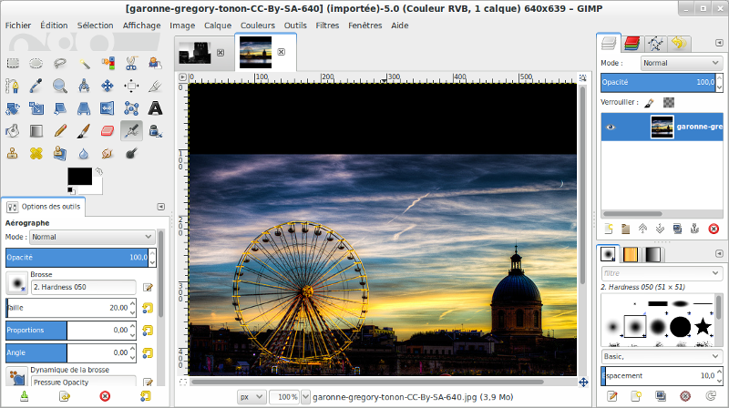

========================================
Retouche et montage de photos avec Gimp
========================================

Médiathèque de Tournefeuille

Jeudi 27 Mars 2014

.fx: first-slide

----

GIMP c'est quoi ?
=================

Logiciel libre de manipulation d'**images bitmap**

**GNU Image Manipulation Programm**

`http://www.gimp.org/ <http://www.gimp.org/>`__

----

Interface
==========

* Menu
* Outils et autres fenêtres
* Zone de travail

----

Image Bitmap
============

= ensemble de points de couleurs différentes

Exemple : image 600x480

* **définition** : 600*480 = 288 000 pixels
* pour imprimer, on indique la **résolution** : 150pixels par pouce (2.54cm)

Exo : zoom
----------

* ouvrir une image **garonne-gregory-tonon-CC-By-SA-4096.jpg**
   http://www.flickr.com/photos/eriatarka31/7624636092
* zoomer sur l'image

Ces points sont des **pixels**

----

Taille de l'image ?
===================

-  définition : 4096 x 4093
-  taille du fichier : **11.8Mo**

Un peu trop pour envoyer par mail !

Exo : Redimensionner pour le web
----------------------------------

* *Image > échelle* et taille de l'image
* choisir **800px** et valider
* exporter l'image en .jpg (et renommer le fichier)

Enregistrer le fichier (format natif : .xcf)

----

Sélectionner
============

On peut sélectionner des éléments :
par **forme**, par **couleur**, en **découpant**

Exo : Sélectionner une planète
-------------------------

* sur Wikimedia Commons, télécharger une image de planète
   http://commons.wikimedia.org/wiki/File:The_Blue_Marble.jpg
* sélectionner une planète, 2 méthodes :
   - outil sélection cercle sur la planète
   - outil sélection par couleur, cliquer sur le fond noir, puis inverser la sélection
* la copier dans une nouvelle image :
   *Édition > copier comme > nouvelle image*

----

Les calques
===========

GIMP permet d'empiler des images dans un même fichier : **les calques**

TP : Un clair de Terre
-------------------------

* Ouvrir *US_Congress-Washington_2012--Guillaume-Paumier--CC-By-3.0.jpg* en tant que calque
   *fichier > ouvrir en tant que calque*
* Mettre le calque choisi sous la planète
   *Fenêtre des calques, sélectionner le calque, déplacer*
* Ajuster le cadre
   *Image > Ajuster le canevas aux calques*
* Déplacer la planète : sélectionner le calque, puis
   *Outils de Déplacement*

Pour faire un essai avec d'autres images, on peut insérer d'autres
calques d'image, les cacher ou les rendre visibles

Pour recadrer : *Outil Recadrer*, sélection puis clic au milieu

----

.fx: inverse

----

Ajouter du texte
================

Gimp peut être utile pour faire des cartes de voeux ou des tracts / flyers.

Exo : Ajouter du texte
------------------------

* Outil texte : *couleur = blanc, taille de police = 48px*
* cliquer dans l'image
* écrire du texte "Clair de Terre"

C'est un nouveau calque, dont on peut modifier le contenu et les 
propriétés de la police.

----

Créer un "polaroid"
===================

Méthode 1
---------

En ajoutant un calque blanc supplémentaire sur le fond, on peut obtenir
un effet "polaroid"

* Augmenter la taille du canevas (1280px), puis centrer l'image sur le canevas
* Ajouter un nouveau calque rempli avec la couleur d'Arrière plan (AP)
* Mettre ce calque sous les autres images

Méthode 2
---------

* *Filtre > Décors > Ajouter bordure*
* Choisir la couleur et la largeur, puis valider

----

.fx: inverse

----

Jouer sur la couleur, méthode 1
===============================

Gimp permet de retoucher la couleur des images

TP : Sunset "From Mars"
-------------------------------------

Image sunset-julien-ortet-CC-By-SA.jpg

Teinte, saturation, luminosité
-------------------------------------

* Ouvrir les réglages *Couleurs > Teinte et saturation*
* Modifier la teinte (puis jouer avec les autres éléments)

Pour obtenir une photo en N&B, il suffit de baisser la saturation au maximum

----

.fx: inverse

----

Jouer sur la couleur, méthode 2
===============================

Masque de calque, mode de superposition
----------------------------------------

Permet de n'appliquer que sur une partie de l'image

* Modifier la couleur de premier plan
* Sélectionner toute l'image (ctrl+A) puis réduire la sélection de 80px
* Ajouter un calque, à remplir avec la couleur de PP
* Ajouter un masque de calque (clic droit sur le calque), choisir *Sélection*
* Appliquer le mode de superposition *Lumière douce*

----

.fx: inverse

----

Les filtres
===========

Le mieux est d'expérimenter les filtres un par un :

* Ouvrir **garonne-gregory-tonon-CC-By-SA-640.jpg**
* Sélectionner un rectancle de 160px de large
* *Filtre > ...*
   - *flou > Flou gaussien*
   - *Bruit > Éparpiller*
   - *Artistique > Cubisme*
   - *Artistique > GIMPressionniste*, puis *Crosshatch*

----

.fx: inverse

----

Peindre et dessiner
===================

Utilisation des outils de remplissage, brosse, crayon, aérographe, calligraphie, dans une nouvelle image. 

Disque de couleur
-----------------

* Sélection circulaire (ctrl + sélection elliptique)
* Choisir une couleur
* Outil remplissage, puis clic dans la sélection

----

Aller plus loin
===============

Sur Gimp
--------

* Documentation en ligne
   
* Forum d'entraide francophone
   http://www.linuxgraphic.org/forums/

Autres logiciels libres pour le graphisme
-----------------------------------------

* MyPaint : pour peindre avec une tablette graphique
   http://mypaint.intilinux.com/
* Inkscape : pour l'illustration
   http://www.inkscape.org/fr/

----

Questions ?
===========

----

Événements à venir
===================

Fête du libre à la Médiathèque de Tournefeuille
-------------------------------------------------

* vendredi 28 : wikipedia
* samedi 29 : imprimantes 3D et Blender

Événements Toulibre
-------------------

* 5 avril : atelier Gimp au CC de Bellegarde à Toulouse
* 12 avril : install party à l'Utopia Tournefeuille

----

Crédits
=======

Cette présentation
------------------

Creative Commons By 3.0
    http://creativecommons.org/licenses/by/3.0/fr/

Photos
------

* *Slide 3, 4, 17* : Toulouse Plages, *Gregory Tonon*, **CC-By-SA**
   http://www.flickr.com/photos/eriatarka31/7624636092
* *Slide 6, 8, 11* : The blue Marble, *NASA*, **Public Domain** (in Wikimedia Commons)
   http://commons.wikimedia.org/wiki/File:The_Blue_Marble.jpg
* *Slide 7, 8 et 11* : US Congress Washinton, *Guillaume Paumier*, **CC-By**
   https://www.flickr.com/photos/gpaumier/12269354843/
* *Slide 12, 13, 15* : Breton Sunset, *Julien Ortet*, **CC-By-SA**
   http://www.flickr.com/photos/julien_ortet/9644009345/

