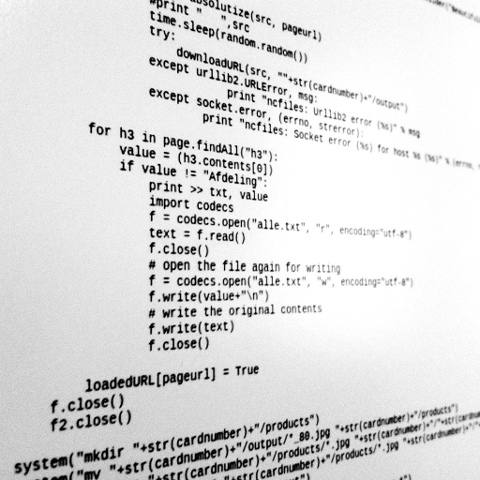
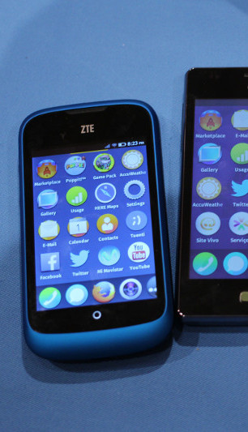
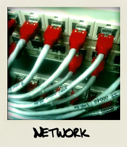

=================================
Logiciels Libres et culture libre
=================================

Libérons l'informatique
-----------------------

Pavillon Blanc, Colomiers

Samedi 7 mars

--

Emmanuelle Helly, association Toulibre

Pouhiou, association Framasoft

--

Présentation CC-0

.fx: first-slide

----

Un Logiciel Libre, c'est quoi ?
-------------------------------

----

Vous connaissez des Logiciels Libres
------------------------------------

* Naviguer sur Internet avec **Firefox**
* Suite bureautique **LibreOffice**
* Couteau suisse de la vidéo **VLC**

Et peut-être

* Lire les emails avec **Thunderbird**
* Retouche image **Gimp**
* Dessin vectoriel **Inkscape**

En savoir plus sur l'annuaire du Libre
http://framasoft.net/

----

Un Logiciel Libre, c'est quoi ?
--------------------------------

Les 4 libertés
===============

* liberté 0 : d'utiliser
* liberté 1 : de copier
* liberté 2 : d'étudier
* liberté 3 : de modifier le logiciel et de redistribuer les versions modifiées

Principe de la licence GNU GPL, créée en 1983 par Richard Stallmann

----

« Liberté, Égalité, Fraternité »
--------------------------------

*« Eugène Delacroix - La liberté guidant le peuple »*

.fx: inverse

----

Le code source ?
----------------

Ce qui est écrit par le développeur dans un langage de programmation, la **recette**

.. code::

    if $age >= 18:
        print "vous êtes majeur"

Transformé en langage binaire pour être exécuté sur la machine

Presenter notes
---------------

Le code binaire est illisible par l'humain, qui a besoin du code source pour **étudier** et **redistribuer**

----

Libérez votre ordinateur
------------------------

GNU/Linux, système d'exploitation libre
=======================================

* Les mêmes logiciels, et pleins d'autres
* Installation et utilisation accessible à tous
* Système sûr et fiable
* Permet d'aller plus loin dans l'utilisation et l'apprentissage de l'informatique

.. image:: img/gnus.png

----

Vocabulaire
------------

* **Distribution Linux**: Noyau + gestionnaire de paquets + environnement de bureau + suite de logiciels
* **Noyau Linux**: Coeur de Linux
* **Gestionnaire de paquets**: système qui permet d'installer ou désinstaller des logiciels sur l'ordinateur
* **Environnement de bureau**: système qui permet de gérer les fenêtres, les raccourcis, les préférences, ...

----

Les variantes de GNU/Linux
---------------------------

On les appelle des **distributions**

* `Debian <http://www.debian.org/>`_ (1993),
* `RedHat <https://redhat.com>`_ (1994),
* `Fedora <https://fedoraproject.org/>`_ (2003), 
* `Ubuntu <http://www.ubuntu.com/>`_ (2004)
* `Mint <http://www.linuxmint.com/>`_ (2006)

    

----

Diversité d'interfaces utilisateurs
-----------------------------------

.. image:: img/environnement-graphique.png

Presenter notes
================

* Les environnements de bureau

- Unity
- Gnome
- KDE
- Maté
- XFCE

* Dérivés d'Ubuntu :

- Kubuntu, http://www.kubuntu.org/ (2005)
- Xubuntu, http://xubuntu.org/ (2005)
- Lubuntu, http://lubuntu.net/ (2008)

.fx: inverse

----

Dégooglisons Internet !!
-------------------------

----

Comment libérer et redécentraliser le web
------------------------------------------

Des applications Web libres pour ...
======================================

* créer un blog ou un site internet
* héberger nos propres mails
* des réseaux sociaux
* exposer des photos
* communiquer 
* s'organiser à plusieurs

.fx: inverse

----

Campagne http://degooglisons-internet.org
-----------------------------------------

* Initiative de Framasoft
* Alternatives aux services utilisés massivement
* Documenter et démysitifier 
* Objectif : essaimer !

http://degooglisons-internet.org/

----

Le libre est partout !
-----------------------

----

Sur votre téléphone
-------------------

Android (2005)
===================

- presque libre
- Replicant (2010), dérivé d'Android sans les composants propriétaires

FirefoxOS (2011)
===================

premier téléphone juillet 2013

Ubuntu phone (2013)
===================

plusieurs téléphones en cours de sortie

----

Et aussi ...
-------------

* les réseaux : basés sur des protocoles ouverts et standardisés
* domotique, robots, télé, consoles ... il y a du libre dedans
* les objets connectés

Vivons-nous une nouvelle révolution technologique ?

----

Le libre, ce bien commun
-------------------------

----

Libérer l'information et les savoirs
-------------------------------------

OpenData
==========

Rappel ! des données **non nominatives**

* exemple : l'usage des impôts, les horaires de bus, ...
* la cartographie libre : OpenStreetMap
* Résultats des prochaines élections

Savoirs communs
================

Wikimedia commons, Wikipedia

Les standards ouverts
=====================

Permettant l'**interopérabilité**, c'est-à-dire l'échange d'un même fichier entre deux logiciels différents.

----

Le matériel Libre
------------------

Mouvements des fablabs (**Artilect**) et des hackerspaces (**Tetalab**)

Imprimantes 3D
==============

Elargit le domaine des possibles

Et plus encore
===============

* `OpenSourceEcology <http://opensourceecology.org/>`_ et `Global Village construction set <https://linuxfr.org/news/kit-de-construction-du-village-global>`_
* `Semences libres <http://scinfolex.com/2013/05/03/open-source-seeds-licence-une-licence-pour-liberer-les-semences/>`_

.. image:: img/global-village-construction-set.png

----

Les réseaux ouverts
-------------------

Sans les réseaux, pas de coopération ...

La neutralité du Net
====================

* Accès au même réseau pour tous

Censure du Net
==============

* Refuser la censure a priori et le filtrage administratif
* Si contrôle il doit y avoir, cela doit passer par un juge !

Vie privées, données personnelles
==================================

* **Edward Snowden**
* Contre la surveillance généralisée

La Quadrature du Net défend nos libertés numériques https://www.laquadrature.net/

----

Le libre, ce bien commun
-------------------------

.. class:: align-center

**« Il serait dommage de ne libérer que le logiciel »**

----

La création libérée
-------------------

----

Plus de libertés aux utilisateurs
----------------------------------

* Pour se faire connaître
* Se désintoxiquer de la propriété intellectuelle

----

La création pour et par tous
---------------------------------

* Années 80, l'Art pour tous
* Aujourd'hui la création artistique par tous, pour tous et partout

----

En pratique
------------

Des dispositifs juridiques

* les licences Creative Commons
* Licence Art Libre

Les auteurs permettent aux utilisateurs plus d'usages que le droit d'auteur simple

----

le Domaine Public
------------------

La création artistique, originale : vraiment ?

----

Dans tous les domaines
-----------------------

* Musique
* Cinéma
* Littérature
* Bande dessinée
* Peinture
* ...

----

Credits
--------

* `« Earth Eastern Hemisphere » <http://visibleearth.nasa.gov/view_detail.php?id=2429http://veimages.gsfc.nasa.gov//2429/globe_east_540.jpg>`_ by NASA. Licensed under Public domain via `Wikimedia Commons  <http://commons.wikimedia.org/wiki/File:Earth_Eastern_Hemisphere.jpg#mediaviewer/File:Earth_Eastern_Hemisphere.jpg>`_

* « Firefox OS phones », Par Maurizio Pesce, CC-By 2.0
* « Intérieur cathédrale d'Albi » Par Nicolas Lefebvre, CC-By 2.0
* « Sunday Bazar » Par Zainub Razvi, CC-By-SA 2.0
* « Global village construction set », from `Open Source Ecology <http://opensourceecology.org/gvcs>`_

----

Questions ?
--------
