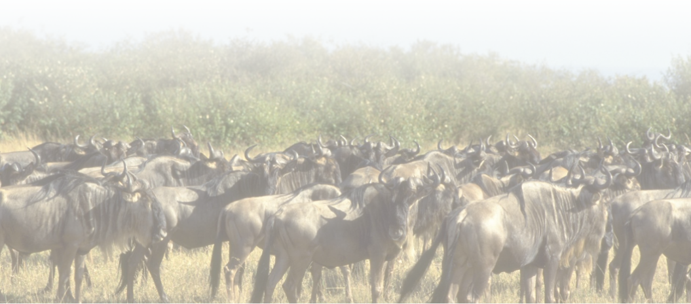

==============================
Logiciels Libres, et aussi ...
==============================

Zoom du Mardi
--------------

Médiathèque Ludothèque de Blagnac

Mardi 2 décembre 2014

--

Association Toulibre

Emmanuelle Helly, Guillaume Gasnier

--

Présentation CC-By 3.0

.fx: first-slide

----

Un Logiciel Libre, c'est quoi ?
-------------------------------

----

Vous connaissez des Logiciels Libres
------------------------------------

* Naviguer sur Internet avec **Firefox**
* Suite bureautique **LibreOffice**
* Couteau suisse de la vidéo **VLC**

Et peut-être

* Lire les emails avec **Thunderbird**
* Retouche image **Gimp**
* Dessin vectoriel **Inkscape**

En savoir plus sur l'annuaire du Libre
http://framasoft.net/

----

Quelques dates clés
---------------------

1. 1983 : **Richard Stallmann** crée la GNU General Public License (GNU GPL) et fonde la FSF (Free Software Foundation)
2. 1991 : **Linus Torwald** démarre le développement de Linux (coeur du système) sous licence GNU GPL
3. 1992 : Balbutiement du Web, création du langage HTML par **Tim Berners Lee**
4. 2001 : Création des licences *Creative Commons* par **Lawrence Lessing**

----

Un Logiciel Libre, c'est quoi ?
--------------------------------

Un logiciel sous licence GNU GPL.
D'autres licences existent par exemple la licence BSD (Berkeley Software Distribution).

Les 4 libertés
===============

* liberté 0 : d'utiliser
* liberté 1 : de copier
* liberté 2 : d'étudier
* liberté 3 : de modifier le logiciel et de redistribuer les versions modifiées

----

« Liberté, Égalité, Fraternité »
--------------------------------

.. image:: img/1137px-Eugène_Delacroix_-_La_liberté_guidant_le_peuple.jpg
    :class: bg-img

*« Eugène Delacroix - La liberté guidant le peuple »*

.fx: inverse

----

Nos libertés
----------------

.. image:: img/comparatif-libre-proprio.jpg
    :width: 100%

Cela implique d'avoir accès au code source, mais n'est pas une condition suffisante.

----

Le code source ?
----------------

.. image:: img/480-source-code-photo-tim-lucas-cc-by.jpg
    :align: right

Ce qui est écrit par le développeur dans un langage de programmation, la **recette**

.. code::

    if $age >= 18:
        print "vous êtes majeur"

Transformé en langage binaire pour être exécuté sur la machine

Presenter notes
---------------

Le code binaire est illisible par l'humain, qui a besoin du code source pour **étudier** et **redistribuer**

----

Des Logiciels Libres un peu partout
------------------------------------

----

D'autres logiciels libres
-------------------------

Pour nos usages
===============

* Lire ses mails avec **Thunderbird**
* Écouter de la musique avec **Audacious**
* Lire des vidéos avec **VLC**

Pour créer
==========

* **Gimp**, **Inkscape**, **Krita**, **myPaint** pour les arts graphiques
* **Ardour**, **Audacity**, **Hydrogen** pour la musique
* **Blender** pour l'animation 3D

----

Libérez votre ordinateur
------------------------

GNU/Linux, système d'exploitation libre
=======================================

* Les mêmes logiciels, et pleins d'autres
* Installation et utilisation accessible à tous
* Système sûr et fiable
* Permet d'aller plus loin dans l'utilisation et l'apprentissage de l'informatique

----

Plusieurs déclinaisons
----------------------

Vocabulaire
============

:Distribution Linux: Noyau + gestionnaire de paquets + environnement de bureau + suite de logiciels
:Noyau Linux: Coeur de Linux
:Gestionnaire de paquets: système qui permet d'installer ou désinstaller des logiciels sur l'ordinateur
:Environnement de bureau: système qui permet de gérer les fenêtres, les raccourcis, les préférences, ...

----

Les distributions GNU/Linux
---------------------------

* Debian, http://www.debian.org/ (1993)
* Slackware, http://www.slackware.com/ (1993)
* Arch Linux, https://www.archlinux.org/ (2002)
* Fedora, https://fedoraproject.org/ (2003)
* Ubuntu, http://www.ubuntu.com/ (2004)
* Mint, http://www.linuxmint.com/ (2006)

Les environnements de bureau
==============================

* Unity
* Gnome
* KDE
* Maté
* XFCE

Presenter notes
================

* Dérivés d'Ubuntu :

- Kubuntu, http://www.kubuntu.org/ (2005)
- Xubuntu, http://xubuntu.org/ (2005)
- Lubuntu, http://lubuntu.net/ (2008)

----

Diversité d'interfaces utilisateurs
-----------------------------------

.fx: inverse

----

Des applications libres pour le Web
------------------------------------

.. image:: img/480px-Earth_Eastern_Hemisphere.jpg
    :align: right

Sur le web aussi, des outils libres
====================================

* créer un blog ou un site internet
* héberger nos propres mails
* des réseaux sociaux
* exposer des photos
* communiquer 
* s'organiser à plusieurs

http://degooglisons-internet.org

.fx: inverse

----

Sur votre téléphone
-------------------

Android (2005)
==============

- presque libre
- premier téléphone (HTC Dream), octobre 2008

Replicant (2010)
================

- dérivé d'Android 
- sans les composants propriétaires

----

D'autres alternatives
---------------------

FirefoxOS (2011)
================

- premier téléphone juillet 2013

Ubuntu phone (2013)
===================

- pas de téléphone disponible à ce jour
- seulement annoncé

.. figure:: img/mobile-firefoxos-photo-maurizio-pesce-cc-by.jpg
    :class: bg-img bg-right

----

Et ailleurs
-------------

* réseau
* domotique
* objets connectés
* robots

----

Libre, vraiment ?
-----------------

----

Modèle économique
------------------

Communautés
============

* Fondations
* Crowdfunding, dons
* Contributions
  - développement
  - traductions
  - documentation ...

Entreprises
===========

* Développer des services et du conseil basé sur les Logiciels Libres
* Amenées aussi à contribuer

Institutions
=============

* Économie, Éthique
* Nos impôts, nos logiciels ?
* Des avancées dans l'adoption des Logiciels Libres

----

Gouvernance
-----------

Modèles de « la Cathédrale et du Bazar »

* Gentil dictateur
* Autogestion

**En général entre les deux**

----

Le libre, ce bien commun
-------------------------

----

Le libre, c'est aussi
-----------------------

* l'information
* les savoirs
* la création, la culture
* le matériel
* les réseaux

.. class:: align-center

**« Il serait dommage de ne libérer que le logiciel »**

----

Libérer l'information et les savoirs
-------------------------------------

OpenData
==========

Rappel ! des données **non nominatives**

* exemple : l'usage des impôts, les horaires de bus, ...
* la cartographie libre : OpenStreetMap

Savoirs communs
================

Wikimedia commons, Wikipedia

Les standards ouverts
=====================

Permettant l'**interopérabilité**, c'est-à-dire l'échange d'un même fichier entre deux logiciels différents.

----

La création pour et par tous
---------------------------------

* les licences Creative Commons
* Les auteurs permettent aux utilisateurs plus d'usages que le droit d'auteur simple
* le Domaine Public

Dans tous les domaines
=======================

* Musique
* Cinéma
* Littérature
* Bande dessinée
* Peinture (numérique)

----

Le matériel Libre
------------------

Mouvements des fablabs (**Artilect**) et des hackerspaces (**Tetalab**)

Imprimantes 3D
==============

Elargit le domaine des possibles

Et plus encore
===============

* `OpenSourceEcology <http://opensourceecology.org/>`_ et `Global Village construction set <https://linuxfr.org/news/kit-de-construction-du-village-global>`_
* `Semences libres <http://scinfolex.com/2013/05/03/open-source-seeds-licence-une-licence-pour-liberer-les-semences/>`_

----

Les réseaux ouverts
-------------------

.. image:: img/network-photo-martin-abegglen-by-SA.jpg
    :align: right

Sans les réseaux, pas de coopération ...

La neutralité du Net
====================

* Accès au même réseau pour tous

Censure du Net
==============

* Refuser la censure a priori et le filtrage administratif
* Si contrôle il doit y avoir, cela doit passer par un juge !

Vie privées, données personnelles
==================================

* **Edward Snowden**
* Contre la surveillance généralisée

La Quadrature du Net défend nos libertés numériques https://www.laquadrature.net/

----

Credits
--------

* `« Earth Eastern Hemisphere » <http://visibleearth.nasa.gov/view_detail.php?id=2429http://veimages.gsfc.nasa.gov//2429/globe_east_540.jpg>`_ by NASA. Licensed under Public domain via `Wikimedia Commons  <http://commons.wikimedia.org/wiki/File:Earth_Eastern_Hemisphere.jpg#mediaviewer/File:Earth_Eastern_Hemisphere.jpg>`_

* « Firefox OS phones », Par Maurizio Pesce, CC-By 2.0
* « Intérieur cathédrale d'Albi » Par Nicolas Lefebvre, CC-By 2.0
* « Sunday Bazar » Par Zainub Razvi, CC-By-SA 2.0
* « Global village construction set », from `Open Source Ecology <http://opensourceecology.org/gvcs>`_

----

Questions ?
--------
